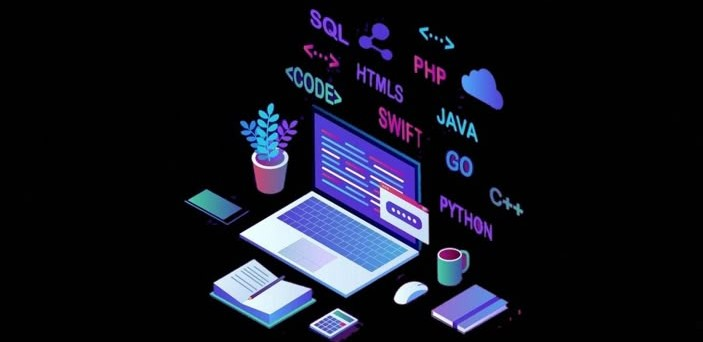

  
  
  # Olá, eu sou o Moises Kennedy! 👋
  
  *"Transformando requisitos em soluções reais através da Engenharia de Software."*

---

  

  

  

 

  
  
  
  
  
  

 

### 🚀 Sobre mim
- 🎓 **FATEC Franca:** Cursando Análise e Desenvolvimento de Sistemas (3º Semestre).
- 🛠️ **Impacto Social:** Atuação no desenvolvimento de projetos para ONGs (Instituto Luz de Lô), aplicando arquitetura em camadas e boas práticas de Engenharia de Software.
- 🎯 **Foco Atual:** Especialização em **Python** e **SQL** voltados para Análise de Dados e Machine Learning.
- 📚 **Soft Skills:** Levantamento de requisitos, diagramação (BPMN, UML) e metodologias ágeis (Scrum).

---

### 🛠️ Tecnologias e Ferramentas

- **Engenharia & Gestão:** BPMN, EAP, TAP, Requisitos e Casos de Uso.
- **Bancos de Dados:** SQLite.
- **Ferramentas de Trabalho:** Termux, Acode, Git e GitHub.

---

### 📬 Vamos nos conectar?

  
  

